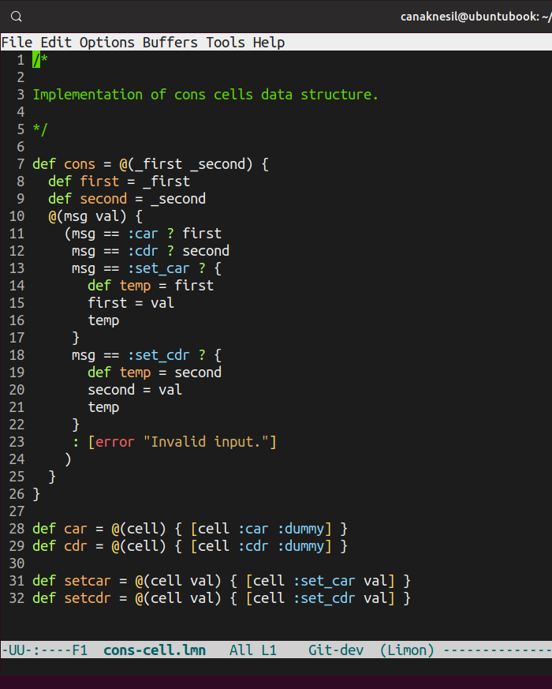

# Limon

Limon is a **high-level**, **dynamically typed** programming
language that supports both **imperative** and **functional programming**
paradigms. It is designed to be elegant, simple, and powerful, without
performance constraints. 

A notable feature of Limon is **infinite recursion without stack
overflow**. This is achieved by the trampolined continuation passing
interpreter. 

### A Simple Example - Cons Cell



## Dependencies

[Julia](https://julialang.org/) 1.4 or higher. Once installed, `julia`
executable should be made accessible. This can be done by adding the
following line to `~/.bashrc`.

```
export PATH=$PATH:<julia-installation-directory>/bin
```

GNU Make.

### Additional Dependencies for Developers

GNU Bison 3.5 or higher, Flex 2.6 or higher, g++.

## Usage

First create the Limon system image by running `make` in the project
directory. And then run `limon` executable in `bin` directory.

```
$ make
mkdir -p lib
...
 Activating environment at `~/Documents/proj/limon/Project.toml`
[ Info: PackageCompiler: creating system image object file, this might take a while...

$ bin/limon
```

`limon --help` for more usage information.

**[EMACS Mode for Limon](https://github.com/canaknesil/limon-mode.el)** 
features syntax coloring and automatic indentation.

## Documentation

Documentation will be added soon.

## Contributers

Can Aknesil - <https://github.com/canaknesil/>
